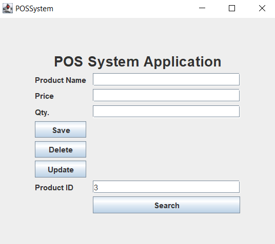
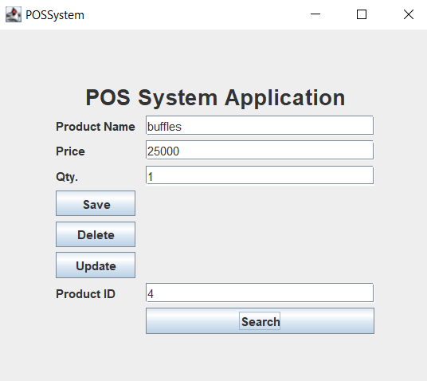

<h1 align="center">
   
  POS System Used in a Supermarket in Java & Swing with GUI
   
</h1>

<h4 align="center">Simple Java & Swing with GUI application to handle supermarket products by search/save/delete/update' to the system.</h4>

  
  
  
   
  <a href="#description">Description</a> 

## Description

Simply refer to the GUI and set input data to explore the mysql database and results. Inhere the database is created by mysql in xampp server and 
frontend GUI components are created by IntelliJ IDE functions.  

### Save
- Can include new products by insert relavant data and save.  
  

### Delete
- Also can delete data for a relavant product id.  

### Update
- Also can modify the inserted product details by clicking update.  

### Search
- Can search for a relavant product id and can see details in the same input data fields.
  

